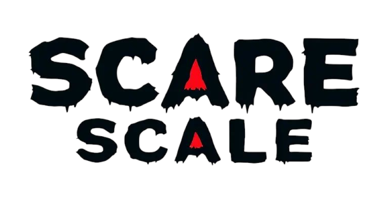

<a href="https://scarescale.com">
    <p align="center">
        
    </p>
</a>

Welcome to **Scare Scale**, a community-driven project designed to categorise and rate horror movies based on their elements such as gore, creepiness, jumpscares, and suspense. Built with Astro JS, this project aims to help horror enthusiasts find movies that match their preferences.

## Features

- **Movie Ratings**: Rate movies based on specific categories.
- **Community Contributions**: Add new movies or update existing entries.
- **Dynamic Content**: Automatically generate markdown files for movies using a Python script.

## Prerequisites

- Install dependencies using `npm install`.

## How to Contribute

### Option 1: Use the Python Script

1. Navigate to the `/scripts/` directory.
2. Set the `TMDB_BEARER_TOKEN` environment variable with your TMDB API key.
3. Run the script:
   ```bash
   python movieMDGenerator.py
   ```
4. Enter the TMDB movie ID when prompted.
5. Commit the generated markdown file and submit a pull request.

### Option 2: Use Page CMS

1. Go to [edit.scarescale.com](https://edit.scarescale.com).
2. Log in with your credentials.
3. Create a new movie entry or edit an existing one.
4. Fill in the required fields, including:
   - Movie name
   - TMDB ID
   - TMDB Poster Path
   - Release date
   - Category ratings (gore, creepy, jumpscares, suspense, psychological)
   - Movie description
5. Save your changes and submit them for review.

### Testing Your Changes

1. Run the app locally:
   ```bash
   npm start
   ```
2. Verify your changes in the browser.
3. Commit your changes and submit a pull request.

## Useful Commands

- `npm install` - Install dependencies.
- `npm start` - Start the development server.
- `npm run build` - Build the project for production.
- `npm run test` - Run all acceptance tests.

## License

This project is open-source and available under the [GNU AFFERO GENERAL PUBLIC LICENSE](LICENSE).
